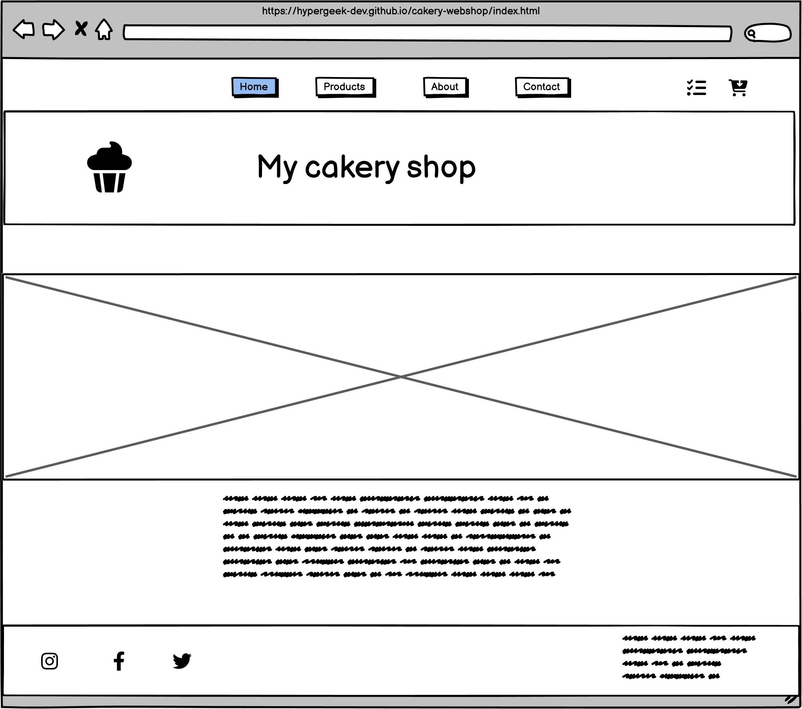
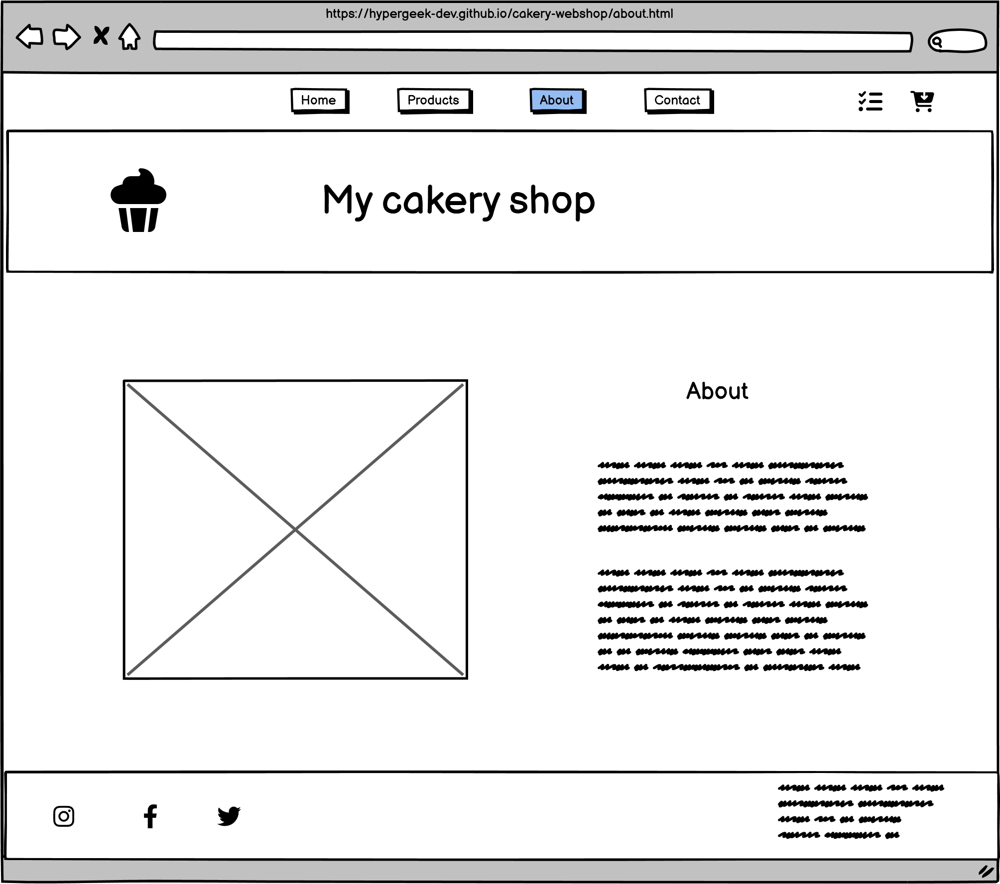
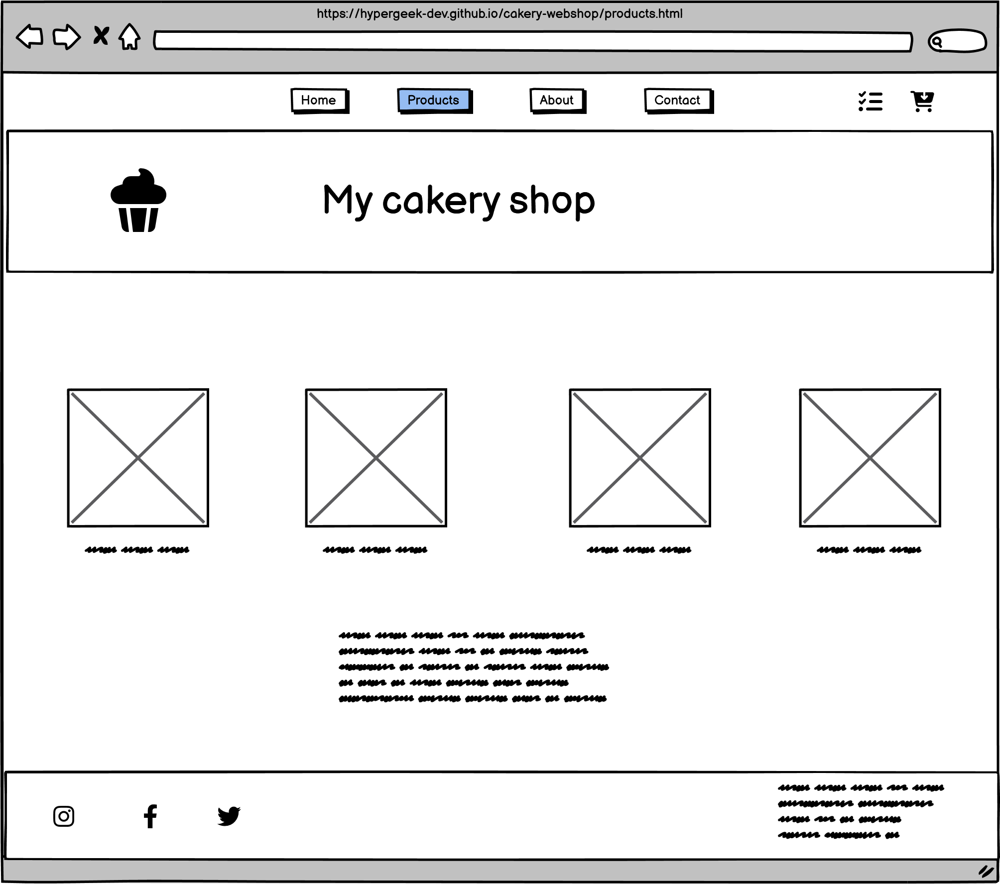
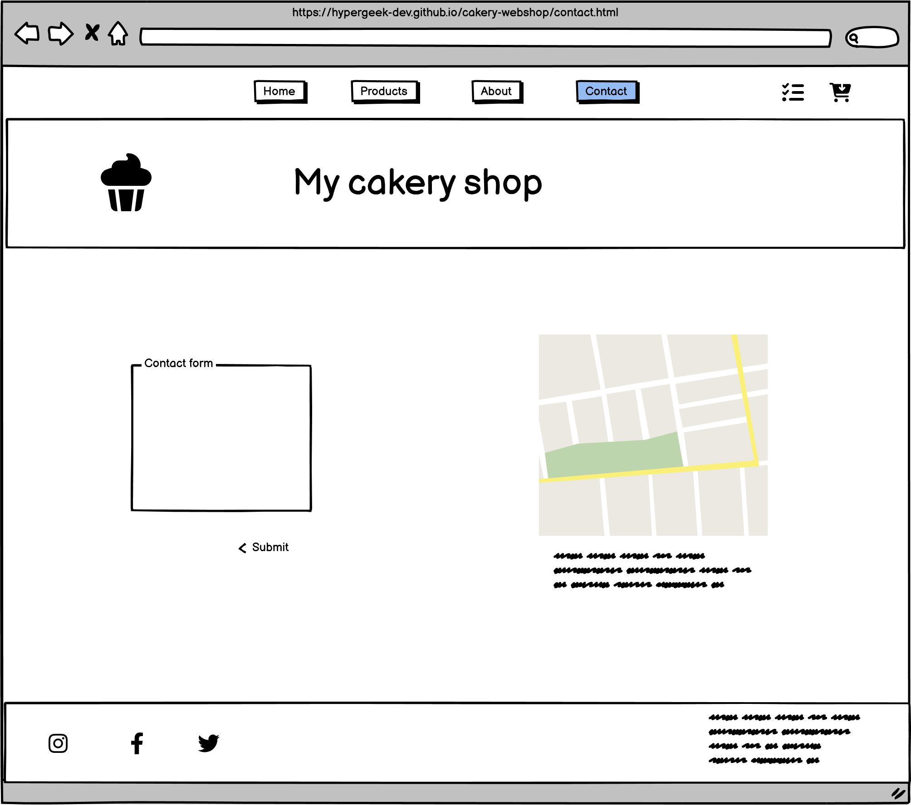
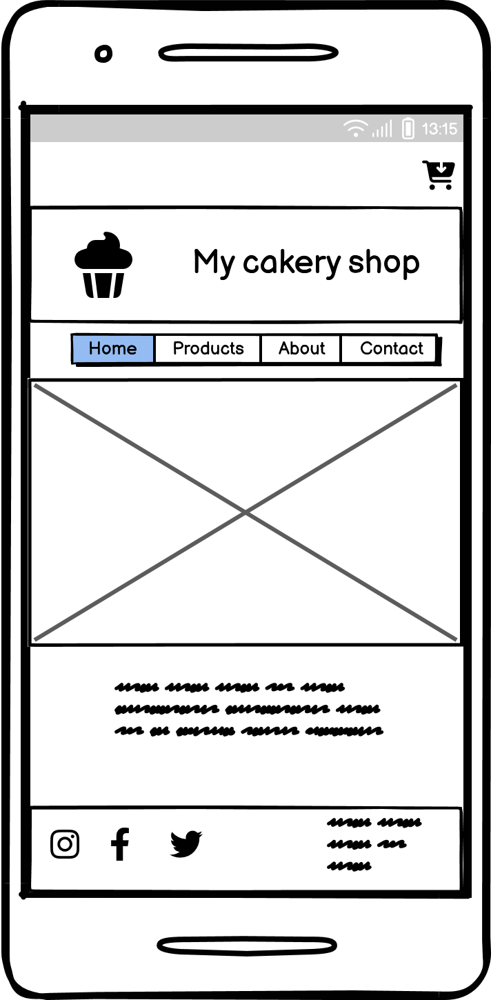
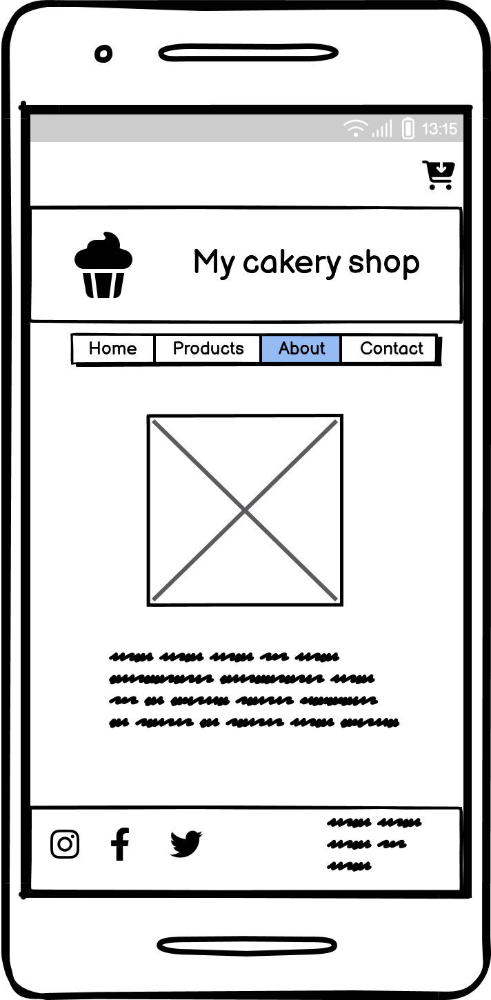
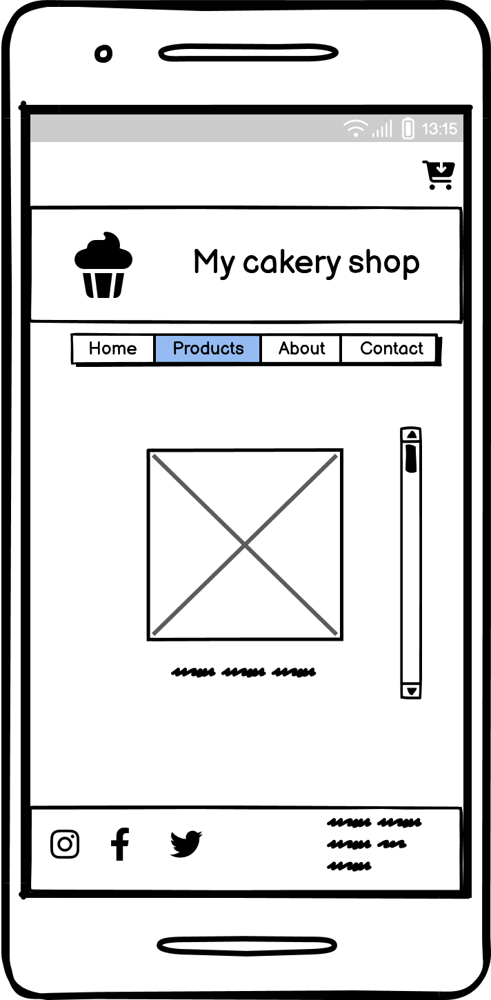
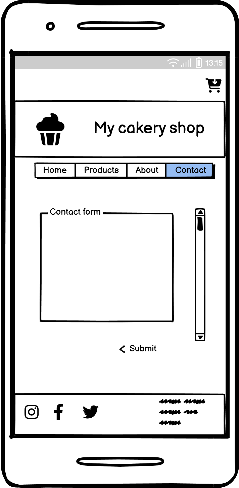

# Cakery Webshop Site README

## Overview
The Cakery Webshop site is a robust web platform tailored for selling cupcakes and wedding cakes. The website has a responsive design, ensuring compatibility with both mobile and desktop devices.

[The site is live here](https://hypergeek-dev.github.io/cakery-webshop/index.html)

## Pages
The website includes four key pages:

- **Home page:** The landing page introduces the cakery and its offerings.
- **About page:** This page offers information about the cakery, its history, and the team.
- **Products page:** The Products page is bifurcated into two categories; Cupcakes and Wedding cakes. Each category features at least 8 different product options.
- **Contact page:** This page includes contact information and a form for visitors to submit inquiries.

## Product Listings
Every product on the Products page is accompanied by a picture, a title, and a price to provide customers with necessary information for purchase decisions.

## Site Navigation
The website's header provides easy navigation with links to the Home, About, Products, and Contact pages. The footer contains links to the cakery's Instagram and Facebook profiles for visitors to connect and stay updated.

## Contact Information
An email link is available in the footer for customers who prefer to contact via email. For privacy reasons, the actual email address has been redacted in this README.

## Consistent Design
The header and footer are consistently designed across all four pages, providing a unified and recognizable brand identity.
## Development

The Cakery Webshop site is developed with responsiveness and user-friendliness in mind. It uses HTML, CSS, and JavaScript for front-end development and a secure server-side language for back-end development.

## Development

The Cakery Webshop site is developed with responsiveness and user-friendliness in mind. It uses HTML, CSS, and JavaScript for front-end development and a secure server-side language for back-end development.

### Wireframes

Wireframes have been created and used during the design process to establish the basic structure of the site before visual design and content creation. Wireframes are designed with a mobile-first approach but also consider the desktop view to ensure a seamless experience across all devices.

#### Desktop Wireframes

Home Page | About Page
--- | ---
 | 

Products Page | Contact Page
--- | ---
 | 

#### Mobile Wireframes

Home Page | About Page | Products Page | Contact Page
--- | ---
 |  | 

### Local Setup

... (Rest of the sections) ...
